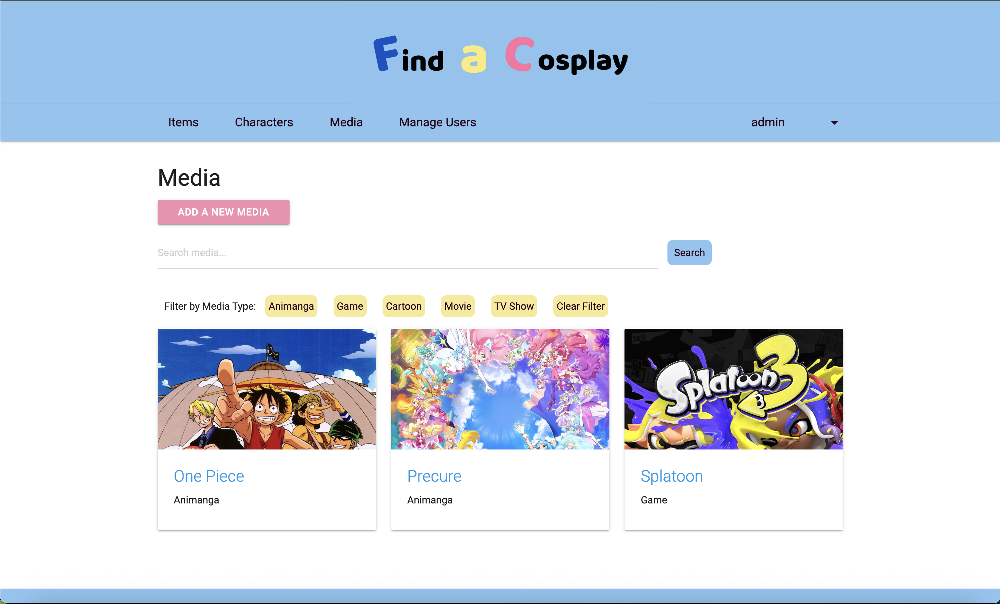
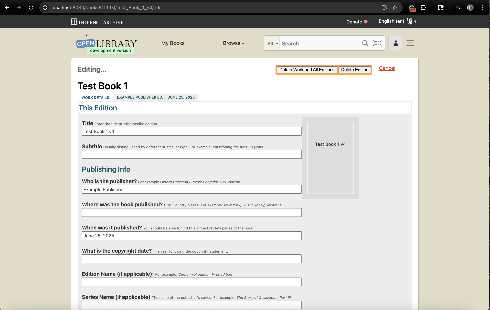
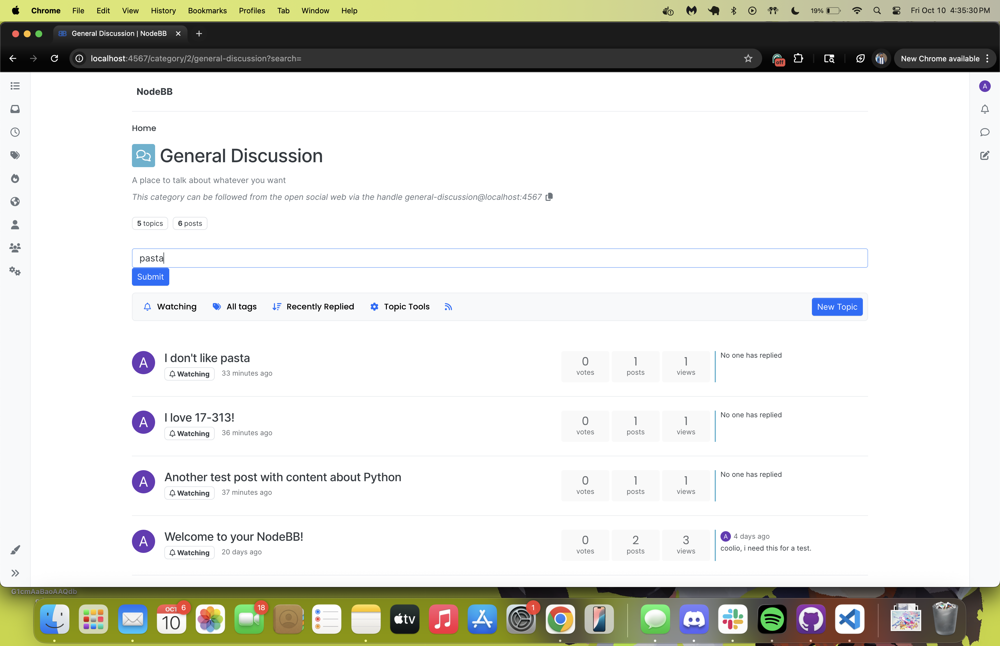
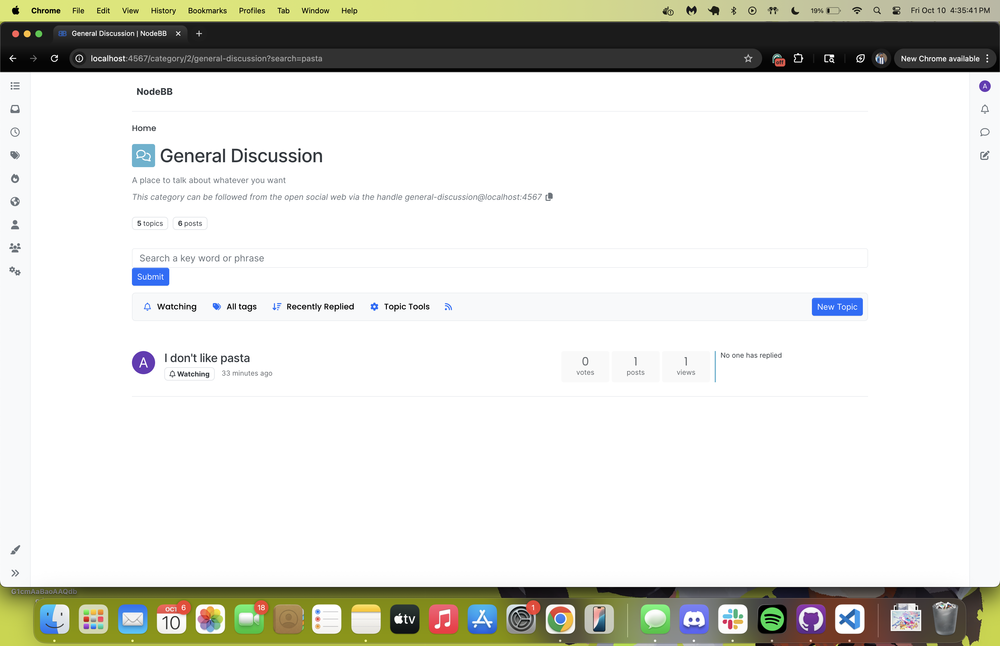

# Stephanie Reed: Projects

## Table of Contents
- [Personal Project (Rails + PostgreSQL + AWS)](#personal-project-find-a-cosplay)
- [Internet Archive Open-Source Contribution](#cmu-17-313-final-project-open-source-contribution)
- [NodeBB New Features and VM Deployment](#cmu-17-313-mid-semester-project-implement-new-nodebb-features)

## [Personal Project: Find a Cosplay](https://github.com/sreed119/findacosplay)
Find a Cosplay is a **Rails app supported with PostgreSQL and AWS!** The site was created as a way to easily keep track of cosplay resources, especially for those that are new to cosplay!  
 

### [Find a Cosplay is now deployed through Render!](https://findacosplay.onrender.com/home)

## [CMU 17-313 Final Project: Open-Source Contribution](https://github.com/internetarchive/openlibrary/pull/11585)
In a group of 4 students, I added a new feature to the Open-Source Project [Internet Archive: Open Library](https://github.com/internetarchive/openlibrary) to address [an existing, posted issue](https://github.com/internetarchive/openlibrary/issues/7973).  
 
Open Library is an editable library catalogue developed on the **Infogami system (derived from the Web.py Python web framework).**  
 
Our group focused on creating a faster way for users to delete editions of a book on the site, as previously users would have to individually delete every edition before deleting the full work. Our contribution added a "Delete Work and All Editions" button that deletes the work and its editions (in batches of 1000) in one click.  

 
 
I personally worked on the [UI for the button](https://github.com/aakwei/openlibrary/pull/1), and wrote the [unit tests for the feature's batching deletion implementation](https://github.com/aakwei/openlibrary/pull/5). I also worked on integrating feedback on our group's PR as the project concluded. 
 
As the final project for 17-313 Foundations of Software Engineering our team was expected to create a [Pull Request](https://github.com/internetarchive/openlibrary/pull/11585) in an Open-Source Project of our choosing that addressed one of the existing issues in the repo. We were also expected to have consistent communication with the maintainers, present to the instructors and other students about our implementation and project experience, and write a report about our criteria for selecting this Open-Source Project and how we attempted to become familiar with the codebase.

## [CMU 17-313 Mid-Semester Project: Implement New NodeBB Features](https://github.com/CMU-313/nodebb-fall-2025-night-owls)
In a group of 4 students, I worked on adding new features to the Open-Source Project [NodeBB](https://github.com/NodeBB/NodeBB), **a forum software powered by Node.js and Redis database.** We also deployed the updated project onto a local CMU Virtual Machine  
 
I created the search feature (including [creating the search input](https://github.com/CMU-313/nodebb-fall-2025-night-owls/pull/27), [integrating the search input with API calls](https://github.com/CMU-313/nodebb-fall-2025-night-owls/pull/36), and [filtering displayed posts](https://github.com/CMU-313/nodebb-fall-2025-night-owls/pull/41)) to filter posts in category pages by queries. I additionally [integrated the static analysis tool JSHint](https://github.com/CMU-313/nodebb-fall-2025-night-owls/pull/47).  

**Entering a Search Query**

**Results of the Search Query**

 
 
As the mid-term project for 17-313 Foundations of Software Engineering our team was expected to fully implement multiple new features, deploy the project successfully to the provided CMU VM, follow standard software development practices in GitHub, and write design document reports of our implementation choices.